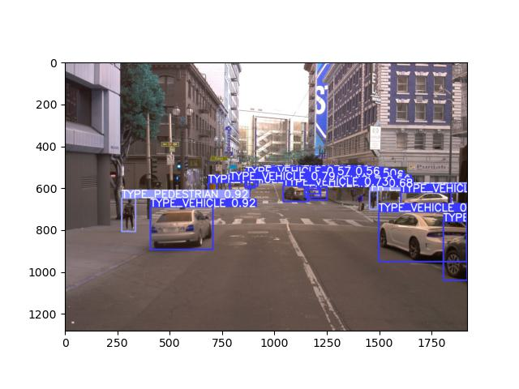
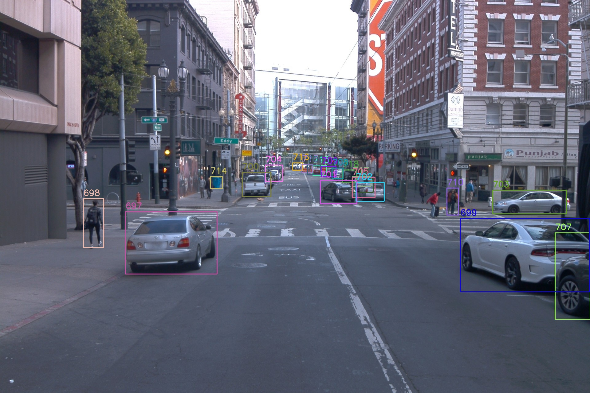

# Multi-Objects Tracking on Waymo Open Dataset
## Data Preparation
### Waymo Object Tracking Dataset to COCO Format
Used package from github (https://github.com/shinya7y/WaymoCOCO) to convert Waymo Object Tracking Dataset to COCO format.
The dataset is now in COCO format. The data store in `datasets/data` folder.
### Transform COCO Format to YOLO Format
In order to train YOLOv8 on the dataset, we need to convert the COCO format to YOLO format. The data store in `datasets/yolo_dataset` folder.
```angular2html
python3 convert_coco_to_yolo.py
```
## Detection and Tracking
All ouputs are stored in `videos` folder.
### Object Detection with YOLOv8
In order to use SORT to track the objects, we need to detect the objects first. 
In this step, we will train YOLOv8 on the dataset. 
Used pre-trained weights from YOLOv8. 
Then, I trained the model on the Waymo Open Dataset, where the epochs is only set to 3 due to the high performance of YOLOv8.
Both code are write in Jupyter Notebook. The result is shown in folder `runs/detect/`.
The example of output image is shown below.
Here is the output of the first image in the dataset. I only generated the output for the front camera in the test dataset.


### Object Tracking with SORT
After detecting the objects, we can use SORT to track the objects.

```angular2html
git clone https://github.com/abewley/sort.git
cd sort
```
```angular2html
pip install -r requirements.txt
```
I used Yolov8's output to track the objects, which includes the bounding box and the class of the object.
And tuned parameter to get the best result. But since the limited time, I only set the max age to 1, IOU threshold to 0.01, 
and the min hits to 0 to optimize the tracking result, but there still have some problems like the object is not detected in some frames, ghosting, etc.
Here is the output of the first image in the dataset. I only generated the output for the front camera in the test dataset. The different colors represent different objects.

